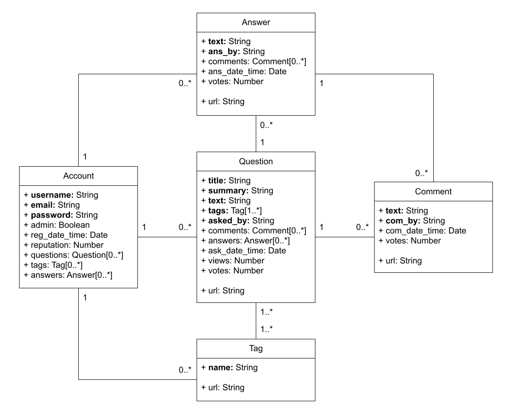

# Fake Stack Overflow

This document describes the specifications of the Fake Stack Overflow application. This application is inspired by the actual [Stack Overflow](https://stackoverflow.com/).

The application is developed using the React framework for the frontend. For the backend, the application uses MongoDB, along with the mongoose data modeling library, to store data that will persist across user sessions. The web server is in Node, using the Express framework for server-side routing.

The axios library is used to send HTTP requests from the client to the server. The application secures sensitive data such as passwords using the bcrypt library in Node by hashing the passwords and storing the hashes instead of the original passwords.

## Application Behavior and Layout

### Welcome Page

This is the initial landing page, which shows options to register as a new user, login as an existing user, or continue as a guest user. If a user clicks on a Log Out button, the user is taken to this page as well.

Selecting the register as a new user option displays a form where the user enters a username, email, password, and password verification. After pressing the Sign Up button, the user is taken to the login form.

Selecting the login as an existing user option displays a form where the user logs in with their email and password. After pressing the Log In button, the user is taken to the [Questions Page](#questions-page).

Selecting the continue as a guest user option takes the user to the [Questions Page](#questions-page).

Appropriate error messages for invalid inputs are displayed below the respective input elements, if any.

If the user has logged in recently, the user will continue to the [Questions Page](#questions-page) without being shown this page.

### Questions Page

This is the home page, which displays all questions asked in the forum. The page can also be reached by clicking on the Questions tab in the navigation menu. The page displays 5 questions at a time, with buttons to display the previous and next questions.

The three buttons, Newest, Active, and Unanswered, are used to sort questions by the date they were posted, sort questions by answer activity, and filter for unanswered questions, respectively. All questions are displayed in Newest order by default.

Every time a user clicks on a question, the number of views for that question will be increased by 1.

A user who is not logged in will not see the option to ask a question.

### New Question Page

When a user clicks on the Ask Question button, the page displays a form for the user to complete.

The user is allowed to add hyperlinks in the question text by enclosing the name of the hyperlink in [] and following it up with the actual link in (), which is the same as in Markdown.

A new tag name can only be created by a user with at least 50 reputation points.

Appropriate error messages for invalid inputs are displayed below the respective input elements, if any.

### Searching by Words and Tags

A user can search for certain questions based on words occurring in the question text or title. If a user surrounds individual words with [], then those words are recognized as names of tags. A search string can contain a combination of [tags] and non-tag words, that is, not surrounded with [].

The search results are displayed when the user presses the ENTER key. If the search string does not match any question, "No Questions Found" is displayed.

### Question Page

Clicking on a question increases the number of views for that question by 1 and displays the answers and comments for that question. The page displays 5 answers at a time, with buttons to display the previous and next answers. Answers also have a set of comments. The most recent answers and comments are displayed first.

The question and answers display 3 comments at a time, with buttons to display the previous and next comments. An input field is provided below the comments for users to be able to comment. The new comment is displayed upon pressing ENTER.

The question, answers, and comments all have buttons to vote on them. However, downvoting comments is not allowed. Upvoting a question or answer increases the reputation of the user by 5. Downvoting a question or answer decreases the reputation of the user by 10. A user can vote on the question and answers and can comment, if their reputation is 50 or higher. Voting on a comment has no reputation constraints.

A user who is not logged in will not see the option to answer the question or ask a question and will not be able to comment.

### New Answer Page

When a user clicks on the Answer Question button, the page displays a form for the user to complete.

The user is allowed to add hyperlinks in the answer text by enclosing the name of the hyperlink in [] and following it up with the actual link in (), which is the same as in Markdown.

Appropriate error messages for invalid inputs are displayed below the respective input elements, if any.

### Tags Page

Clicking on the Tags tab in the navigation menu displays all tags created in the forum. Tag names are case-insensitive. 

Upon clicking on a tag name, all questions associated with the tag are displayed.

A user who is not logged in will not see the option to ask a question.

### User Profile

If a user is logged in and clicks on the Profile button, basic user information is shown at the top. Below this information, the user is able to switch between viewing questions asked by the user, questions answered by the user, and tags created by the user.

When viewing questions asked by the user, clicking on a question shows the [New Question Page](#new-question-page), with existing information for the question filled out in appropriate fields. The user can then edit the existing question and post it again or delete it. Deleting a question will delete all answers and comments associated with it.

When viewing questions answered by the user, clicking on a question shows the [Question Page](#question-page) for that question. Their answer(s) for the question is displayed first, followed by the rest in Newest order. Each of the user's answers has an Edit and Delete button next to it. Clicking on an Edit button shows the [New Answer Page](#new-answer-page) for the corresponding answer, with existing information for the answer filled out in appropriate fields. The user can then edit the existing answer and post it again. Clicking on a Delete button deletes the corresponding answer, as well as all of its votes and comments.

When viewing tags created by the user, each tag has an option for the user to delete or edit the tag. If the user deletes a tag, it will not be shown with any questions. However, a tag can be edited or deleted only if it is not being used by any other user.

### Admin Profile

If a user is logged in as an admin and clicks on the Profile button, basic user information is still shown at the top. However, below this information, all of the users in the database are listed instead.

Clicking on a user takes the admin to the corresponding user’s [User Profile](#user-profile). An admin can access their own [User Profile](#user-profile) this way. An admin has the same read and write permissions as the user on the user’s profile.

Each listed user has a Delete button next to them, which will remove the user and all of their information from the database. A warning message asking for confirmation is displayed to prevent an admin from accidentally deleting a user.

## MongoDB Schema

The UML model describes the schema for all documents in the MongoDB database.

## Instructions to Set Up and Run

1. Clone the repository.

2. Run `npm install` in both the client and server directories.

3. In the server directory, run `node init.js <username> <password>`, where *\<username\>* and *\<password\>* are used to create an admin account.

4. In the server directory, run `node server.js <secret>`, where *\<secret\>* is used as the secret for sessions.

5. In the client directory, run `npm start`.

To log in as the admin, use *\<username\>*@gmail.com as the email, where *\<username\>* is the admin username provided in step 3.

To access the admin's questions asked, questions answered, and tags created, click on the admin's username in the list of users in the admin profile.